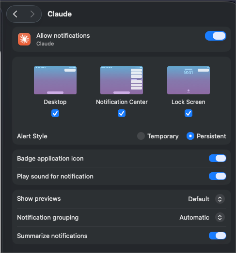

<p align="center">
  
</p>

https://github.com/user-attachments/assets/a06acd74-dd22-4a0c-9f35-bc0d9dba9de6

# squawk

`squawk` brings smart macOS notifications to Claude Code. It only alerts you
when Claude is out of sight, offering quick actions to reply, approve, or jump
to the pane.

## Features

- **Context-Aware Alerts:** Silent when focused, in-pane banners when visible,
  and notifications when off-screen.
- **Inline Replies:** Reply from the notification to keep Claude going.
- **One-Click Approvals:** Allow permission prompts straight from the alert.
- **Message Previews:** See Claude's latest response at a glance.
- **Smart Lifecycle:** Alerts persist until addressed, but auto-clear when you
  focus the pane.
- **Clean Grouping:** Session notifications update in place instead of
  cluttering your screen.
- **Zero-Config:** Works out of the box, with optional env var overrides (see
  [Configuration](#configuration)).

## Events

`squawk` uses Claude Code hooks to notify on the following events:

| Event               | Fires when                                                  | Notification                                      |
| ------------------- | ----------------------------------------------------------- | ------------------------------------------------- |
| `Stop`              | Claude finishes its turn                                    | **Finished**; reply to keep it going              |
| `StopFailure`       | The turn dies on an API error (rate limit, server error, …) | **Turn failed**                                   |
| `Notification`      | Claude is waiting on you or an MCP server asks for input    | **Needs your input**                              |
| `PermissionRequest` | Claude needs permission to run a tool                       | **Needs your permission**; Approve from the alert |

## Requirements

- **Claude Code**, **`tmux`**, **`jq`**, and **`alerter`** (Core dependencies)
- **Claude for Desktop** _(Optional)_ `squawk` borrows its app icon to make
  notifications look native. Without it, you get a default fallback icon (or you
  can manually set `SQUAWK_ICON`).

```bash
brew install jq tmux claude
brew install vjeantet/tap/alerter
brew install --cask claude-code
```

## Install

```bash
git clone https://github.com/nov1n/squawk ~/.local/share/squawk
~/.local/share/squawk/bin/squawk install
```

Keep the clone where it is as `squawk install` symlinks to it and reads it at
runtime (so `git pull` upgrades in place). `squawk install`:

1. Checks if required dependencies are correctly installed.
2. Symlinks `squawk` into `~/.local/bin` (override with `PREFIX=`).
3. Merges its hooks (`Stop`, `StopFailure`, `Notification`, `PermissionRequest`)
   into `~/.claude/settings.json`.
4. Offers to add the tmux snippet the in-pane banner needs to `~/.tmux.conf` (or
   prints it for you to add yourself).

> **Restart Claude Code** after installing so it loads the new hooks.

## Configuration

All via environment variables (or an optional `~/.config/squawk/config` that's
sourced if present):

| Variable           | Default                    | Purpose                                                                                                                                                                                                                        |
| ------------------ | -------------------------- | ------------------------------------------------------------------------------------------------------------------------------------------------------------------------------------------------------------------------------ |
| `SQUAWK_ICON`      | _(auto)_                   | Bundle id whose **icon** the notification uses (`alerter --sender`). Defaults to the **Claude icon** when Claude for Desktop is installed in a standard path. Set a bundle id to use another app's icon, or `none` to disable. |
| `SQUAWK_BANNER`    | _(yellow ⬤ style)_         | Full tmux `pane-border-format` for the in-pane banner; `{label}` is replaced with the event. Restyle colors, symbols, padding/width, and alignment — e.g. `#[align=left,bg=magenta,fg=white,bold] ▶ {label} `.                 |
| `SQUAWK_TIMEOUT`   | `0`                        | Seconds before a notification auto-dismisses. `0` keeps it **persistent** (squawk clears it when you return to the pane). Set a number to auto-dismiss instead.                                                                |
| `SQUAWK_SOUND`     | _(silent)_                 | Play a sound with the notification. Set to `default` or a macOS system sound name (`Ping`, `Glass`, `Submarine`, …).                                                                                                           |
| `SQUAWK_APPROVE`   | `1`                        | Show the Approve button on permission notifications. Set to `0` for notify-only (decide in the terminal).                                                                                                                      |
| `SQUAWK_REPLY`     | `1`                        | Show a reply field on "Finished" notifications (your reply continues the conversation). Set to `0` for notify-only.                                                                                                            |
| `SQUAWK_ENABLE`    | `1`                        | Set to `0` to disable squawk entirely.                                                                                                                                                                                         |
| `SQUAWK_DEBUG`     | _(unset)_                  | Set to `1` to log decisions to `SQUAWK_DEBUG_LOG`.                                                                                                                                                                             |
| `SQUAWK_DEBUG_LOG` | `$TMPDIR/squawk-debug.log` | Debug log path.                                                                                                                                                                                                                |

## Uninstall

```bash
squawk uninstall
```

Removes the Claude Code hooks (preserving siblings), the `~/.local/bin/squawk`
symlink, and the tmux snippet.

## Development

```bash
make test    # bats suite
make lint    # shellcheck + shfmt
make fmt     # auto-format
```

## FAQ

<details id="faq-notifications">
<summary>Why am I not getting notifications?</summary>

macOS must allow notifications for the app whose icon squawk borrows (Claude
Desktop by default). Open **System Settings → Notifications → Claude**, turn on
**Allow Notifications**, and set the style to **Alerts** so the reply/approve
buttons appear and persist. If notifications still don't show, macOS may be
dropping the impersonated sender — set `SQUAWK_ICON=none` to use the default
icon.



</details>

<details id="faq-approve-button">
<summary>Why doesn't the Approve button show up?</summary>

**The command is too long or multi-line.** You can't safely approve what you
can't fully see, so when it doesn't fit, the body is truncated with `…` and the
button is withheld — click the body to open the pane and approve the full
command there.

</details>

<details id="faq-multiple-clients">
<summary>Does squawk support multiple tmux clients?</summary>

Not fully. When two clients are attached to one session, tmux reports its
pane/window state per-_session_, not per-client, so squawk can't tell which
terminal you're actually looking at and may stay quiet when it should notify. A
single attached client — with any splits, windows, and detached sessions — is
fully handled.

</details>

## AI disclosure

squawk was built almost entirely with Claude Code. The design, implementation,
and tests were produced through AI pair-programming under human direction and
review.

## License

[MIT](LICENSE)
